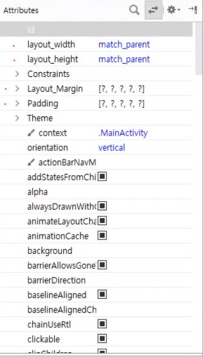

# View

>- `view` : 안드로이드에서 눈에 보이는 모든 요소를 뷰라고 지칭.
>
>  view들은 class로 제공되는데 view라는 클래스를 상속받고 있다.
>
>  view클래스는 모든 UI요소들의 부모클래스로써, 위젯과 레이아웃으로 나뉜다.
>
>- `위젯` : 문자열 입력, 문자열 출력 등 사용자와 상호작용을 하는 뷰들을 통칭.
>
>  

## View의 주요 속성 

>- `id`: xml이나 코드에서의 뷰이름.
>- `layout_width` : 뷰 가로 길이
>- `layout_height` : 뷰 세로 길이.
>- `margin` : 뷰 외부 여백.
>- `padding` : 뷰 내부 여백.
>- `layout_gravity` : 뷰 위치정렬.
>- `gravity` : 뷰 내부 정렬 (텍스트 정렬).
>- `background` : 뷰 배경 지정 (색 or 이미지).
>
>

디바이스 크기에 따라 뷰 모양이 다르게 보임.

따라서 `layout_width` 나`layout_height`에 

 `match_parent` or `wrap_content`를 적용해주자.

> - `match_parent` : 자기가 배치될 수 있는 영역의 최대 크기 (화면 가득채움).
>
> - `wrap_content` : 자기 자신을 나타낼 수 있는 최소 크기 (텍스트의 길이만큼).

## 정리

>안드로이드에서 눈에 보이는 모든 요소들을 View라고 부른다.
>
>View는 위젯과 레이아웃(컨테이너, 뷰그룹)으로 나뉜다.
>
>