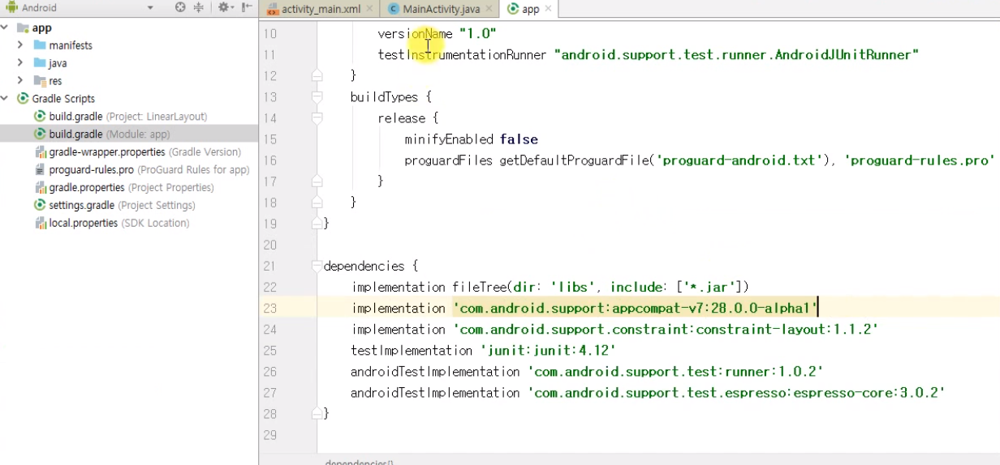
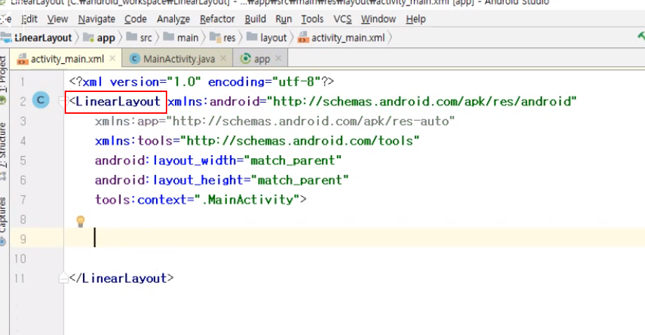
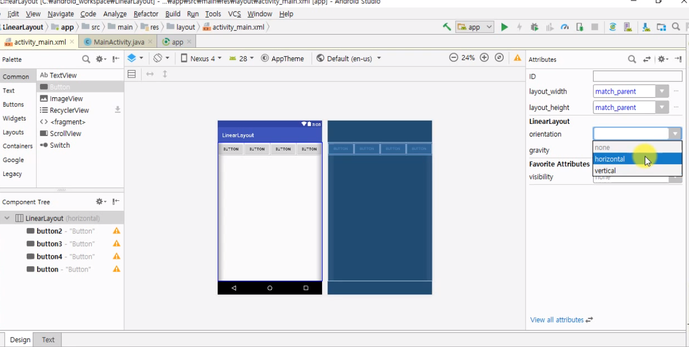
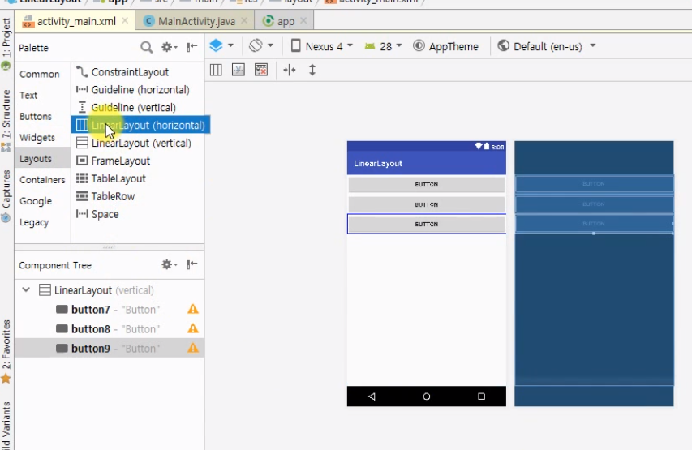
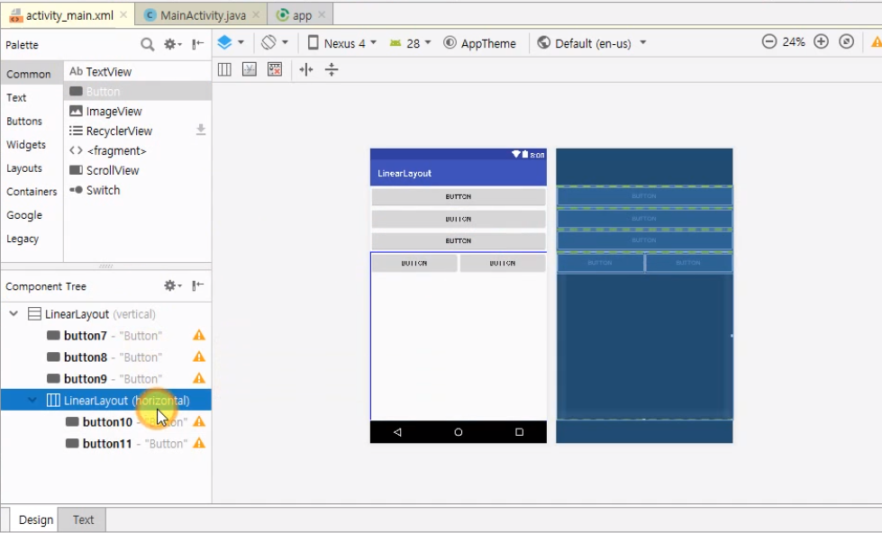

## LinearLayout

>- Layout : 안드로이드에서 화면을 구성할 때, 뷰가 배치되는 모양을 결정하는 것.
>
>  단말기의 종류가 다양하기 때문에 뷰가 배치될 위치를 결정x 배치될 형태를 결정.
>
>  개발자가 배치형태를 결정하면 안드로이드 OS스스로 단말기에 최적화된 사이즈와 위치를 결정하여 뷰를 배치.
>
>

프로젝트를 새로 만들었으면 

build.gradle > alpha1로 수정. (다운로드를 잘못하면 해줘야함 나는 안 해두댐)

###  .xml

코드를 위와 같은 형태로 맞춰줌. (Text)

다음은 Design으로 가서

>LinearLayout을 클릭하면 orientation으로 수직, 수평을 조절할 수 있음.
>
>none(기본값) >> horizontal
>
>

>LinearLayout안에 또 LinearLayout을 넣을 수 있다.
>
>드래그해서 끌어오기.
>
>

### 정리

>Linear Layout은 방향성을 가지고 뷰를 배치하는 Layout이다.
>
>

